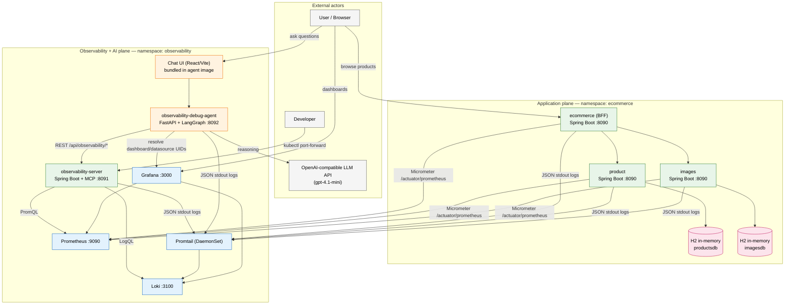
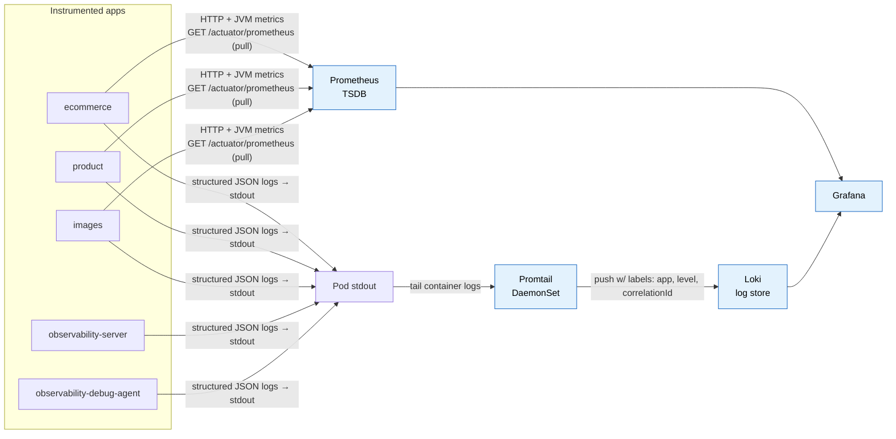
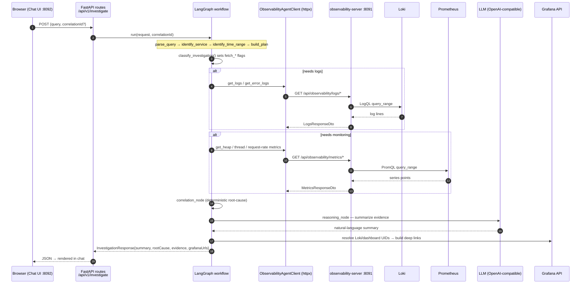
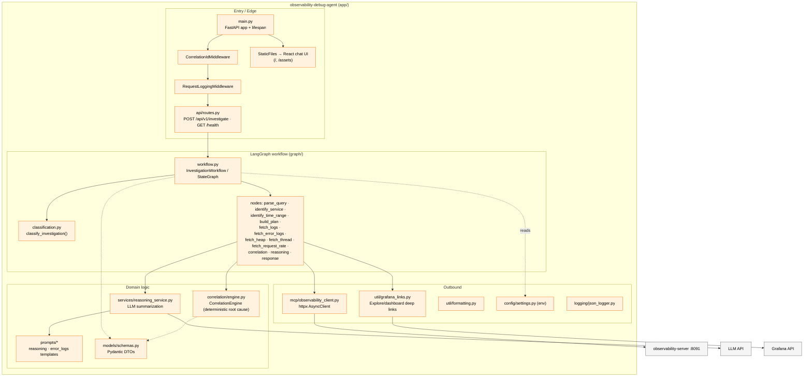
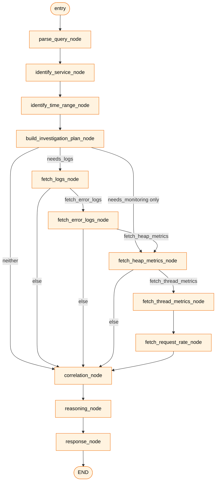
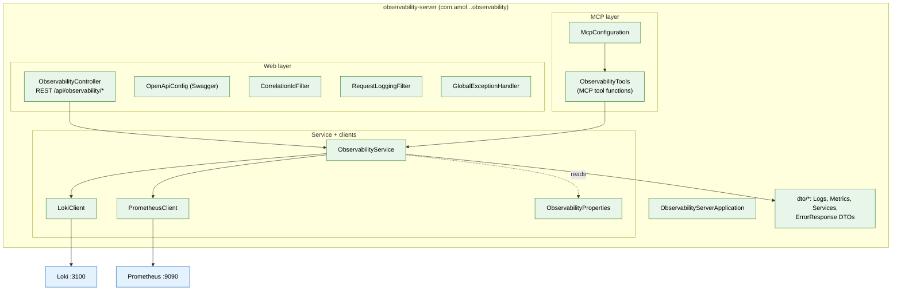
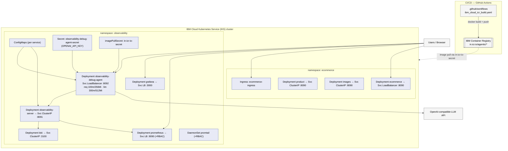
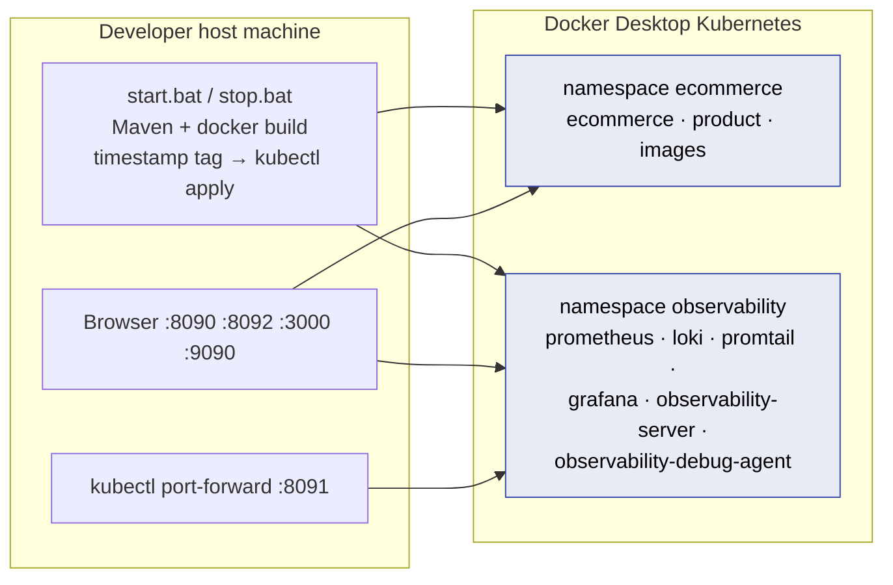
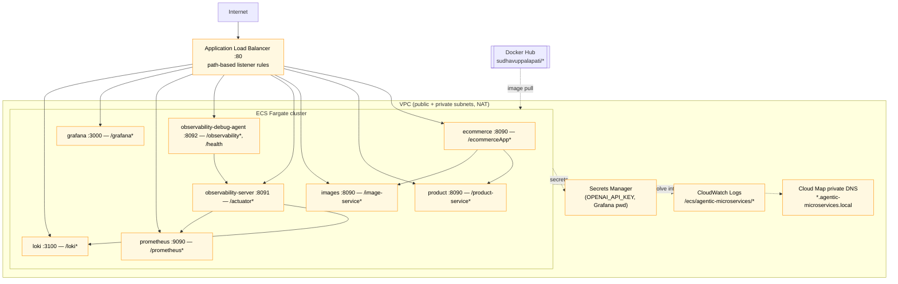

# Agentic Microservices — Architecture, Data Flow, Component & Deployment Diagrams

Kubernetes-native ecommerce demo with a full observability stack and an **agentic AI debug assistant**. An
`observability-server` (Spring Boot + MCP) exposes Loki/Prometheus data over REST, and an
`observability-debug-agent` (FastAPI + LangGraph) turns natural-language questions into automated investigations.

> Primary deployment target is **IBM Cloud Kubernetes Service (IKS)** using **IBM Container Registry (`in.icr.io`)**.
> The repo also ships local Docker Desktop K8s manifests (`k8s/`) and an AWS ECS Fargate alternative (`CF/`).

---

## 1. Project Architecture (High-Level)

**Two planes, one cluster:**
- **Application plane** (`ecommerce`): the demo workload that generates telemetry — a BFF (`ecommerce`) fanning out to `product` and `images`.
- **Observability + AI plane** (`observability`): collects telemetry (Promtail → Loki, scrape → Prometheus), visualizes it (Grafana), and reasons over it (`observability-server` → `observability-debug-agent` → LLM).

---

## 2. Data Flow Diagrams

### 2a. Telemetry ingestion (how data gets collected)

Every log line carries a `correlationId` (from the `X-Correlation-Id` header via `CorrelationIdFilter`/MDC), which is the join key for cross-service investigations.

### 2b. AI investigation data flow (request → answer)

The `correlationId` propagates on every hop (`X-Correlation-Id` header), so the agent's own activity is traceable in the same Loki stream it queries.

---

## 3. Component Architecture

### 3a. observability-debug-agent (FastAPI + LangGraph — Python)

### 3b. LangGraph investigation state machine (conditional routing)

### 3c. observability-server (Spring Boot + MCP — Java)

The server exposes the **same capabilities two ways**: plain REST (used by the debug agent) and **MCP tools** (usable by any MCP-compatible client).

---

## 4. Deployment Diagrams

### 4a. IBM Cloud Kubernetes Service (primary target)

Health gating: the debug agent has `startup`, `readiness`, and `liveness` probes on `GET /health :8092`; at startup it retries `observability-server` (up to 30×) and requires `OPENAI_API_KEY` before serving.

### 4b. Local — Docker Desktop Kubernetes (`start.bat`)

Before the first investigation, create the secret once:
`kubectl create secret generic observability-debug-agent-secret --from-literal=OPENAI_API_KEY=... -n observability`

### 4c. AWS ECS Fargate alternative (`CF/` CloudFormation)

Three stacks deploy in order: `01-infrastructure` (VPC/ALB/ECS/IAM/Secrets/CloudWatch) → `02-microservices` → `03-observability`.

---

## 5. Deployment target comparison

| Aspect | IBM Cloud (IKS) | Local (Docker Desktop) | AWS (ECS Fargate) |
|---|---|---|---|
| Orchestrator | Kubernetes | Kubernetes | ECS Fargate |
| Manifests | `k8s/` | `k8s/` + `start.bat` | `CF/*.yaml` (CloudFormation) |
| Image registry | `in.icr.io/agentic/*` | local build | Docker Hub `sudhavuppalapati/*` |
| Ingress / edge | Ingress + LoadBalancer Svc | LoadBalancer Svc | ALB path rules |
| Service discovery | K8s DNS (`*.svc.cluster.local`) | K8s DNS | Cloud Map (`*.local`) |
| Log store | Loki (in-cluster) | Loki | Loki + CloudWatch |
| Secrets | K8s Secret | K8s Secret | Secrets Manager |
| Pull secret | `in-icr-io-secret` | none | task execution role |

---

## Service catalog

| Component | Tech | Namespace | Exposure | Role |
|---|---|---|---|---|
| ecommerce | Java 21, Spring Boot 3.3 | ecommerce | LoadBalancer :8090 | BFF; aggregates product + images |
| product | Java 21, Spring Boot 3.3 | ecommerce | ClusterIP :8090 | Product catalog (H2) |
| images | Java 21, Spring Boot 3.3 | ecommerce | ClusterIP :8090 | Image metadata (H2) |
| observability-server | Java, Spring Boot, MCP | observability | ClusterIP :8091 | REST + MCP → Loki/Prometheus |
| observability-debug-agent | Python, FastAPI, LangGraph | observability | LoadBalancer :8092 | NL investigation + chat UI |
| Prometheus | Prometheus | observability | LoadBalancer :9090 | Scrapes JVM/HTTP metrics |
| Loki | Grafana Loki | observability | ClusterIP :3100 | Log aggregation |
| Promtail | Promtail | observability | DaemonSet | Ships pod logs → Loki |
| Grafana | Grafana | observability | LoadBalancer :3000 | Dashboards + Explore |

> Related: high-level views in [architecture-diagram.md](architecture-diagram.md); LangGraph node detail in
> [microservices/observability-debug-agent/app/graph/workflow-diagram.md](microservices/observability-debug-agent/app/graph/workflow-diagram.md).
