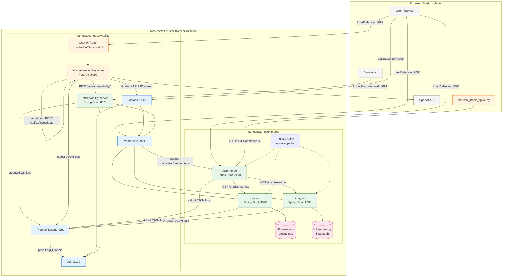
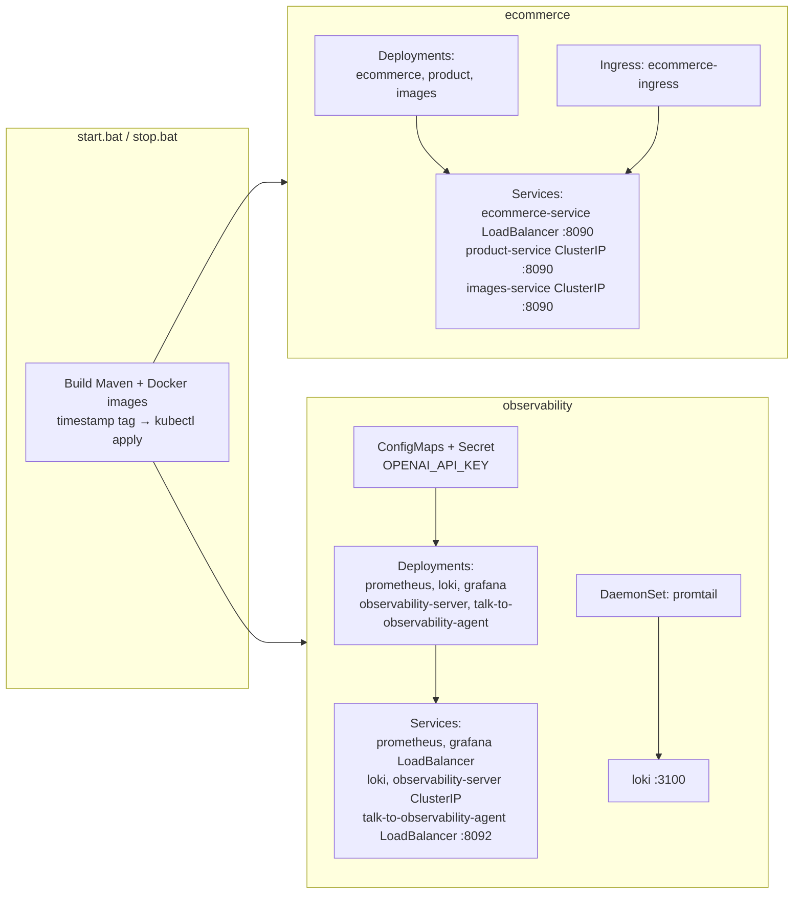
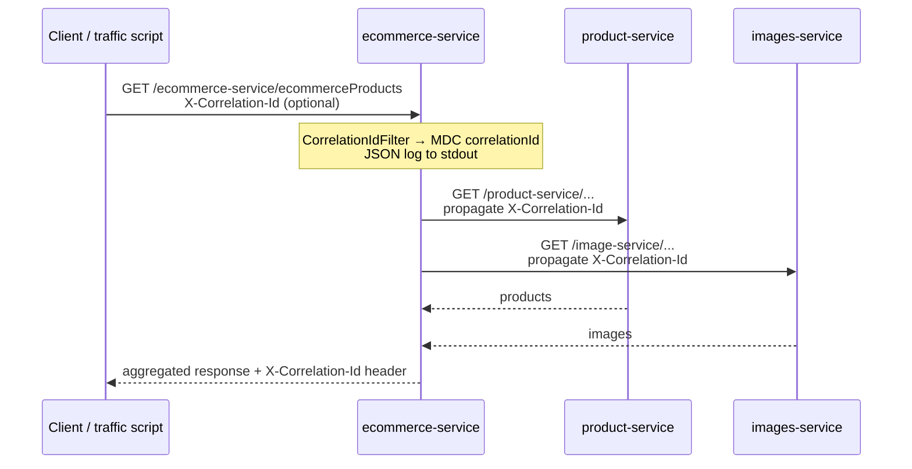
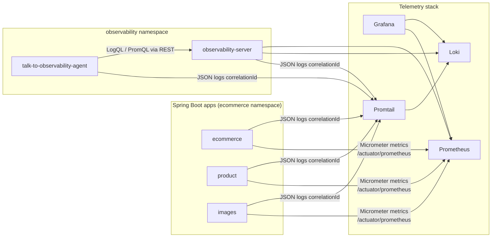
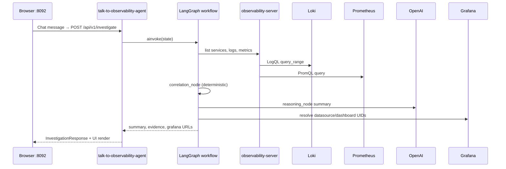

# microservices-ecommerce-2 — Architecture

Kubernetes-native ecommerce demo with full observability stack and AI-assisted investigation. Deployed locally via `start.bat` on Docker Desktop Kubernetes.

## System context



## Kubernetes layout



## Ecommerce request flow



## Observability data plane



## Investigation / chatbot flow



LangGraph node detail: [`workflow-diagram.md`](microservices/talk-to-observability-agent/app/graph/workflow-diagram.md)

## Service catalog

| Component | Tech | Namespace | K8s Service | Exposure | Role |
|-----------|------|-----------|-------------|----------|------|
| ecommerce | Java 21, Spring Boot 3.3 | ecommerce | `ecommerce-service` | LoadBalancer `:8090` | BFF; aggregates product + images |
| product | Java 21, Spring Boot 3.3 | ecommerce | `product-service` | ClusterIP `:8090` | Product catalog (H2) |
| images | Java 21, Spring Boot 3.3 | ecommerce | `images-service` | ClusterIP `:8090` | Image metadata (H2) |
| Ingress | nginx | ecommerce | `ecommerce-ingress` | Ingress rules | Optional path routing |
| Prometheus | Prometheus | observability | `prometheus` | LoadBalancer `:9090` | Scrapes JVM/HTTP metrics |
| Loki | Grafana Loki | observability | `loki` | ClusterIP `:3100` | Log aggregation |
| Promtail | Promtail | observability | DaemonSet | — | Ships pod logs → Loki |
| Grafana | Grafana | observability | `grafana` | LoadBalancer `:3000` | Dashboards + Explore |
| observability-server | Java, Spring Boot, MCP | observability | `observability-server` | ClusterIP `:8091` | REST + MCP → Loki/Prometheus |
| talk-to-observability-agent | Python, FastAPI, LangGraph | observability | `talk-to-observability-agent` | LoadBalancer `:8092` | NL investigation + chat UI |
| traffic script | Python aiohttp | host | — | `localhost:8090` | Demo load + correlation IDs |

## Correlation ID

- Header: `X-Correlation-Id` (generated or forwarded)
- Logged as `correlationId` in JSON stdout → Promtail → Loki
- Used by observability-server LogQL and chat investigations

## Local URLs (after `start.bat`)

| URL | Target |
|-----|--------|
| http://localhost:8090/ecommerce-service/ecommerceProducts | ecommerce API |
| http://localhost:3000 | Grafana |
| http://localhost:9090 | Prometheus |
| http://localhost:8092 | Observability chat UI |
| http://localhost:8092/docs | FastAPI Swagger |
| http://localhost:8091/swagger-ui.html | observability-server *(port-forward)* |

## Repository map (runtime)

```
microservices/
  ecommerce/          → Deployment in ecommerce
  product/            → Deployment in ecommerce
  images/             → Deployment in ecommerce
  observability-server/→ Deployment in observability
  talk-to-observability-agent/
    app/graph/        → LangGraph workflow
    ui/               → React chat (built into image)
k8s/
  ecommerce/          → app manifests
  ingress/
  observability/      → prometheus, loki, promtail, grafana
  observability-server/
  talk-to-observability-agent/
start.bat / stop.bat  → local orchestration
```
