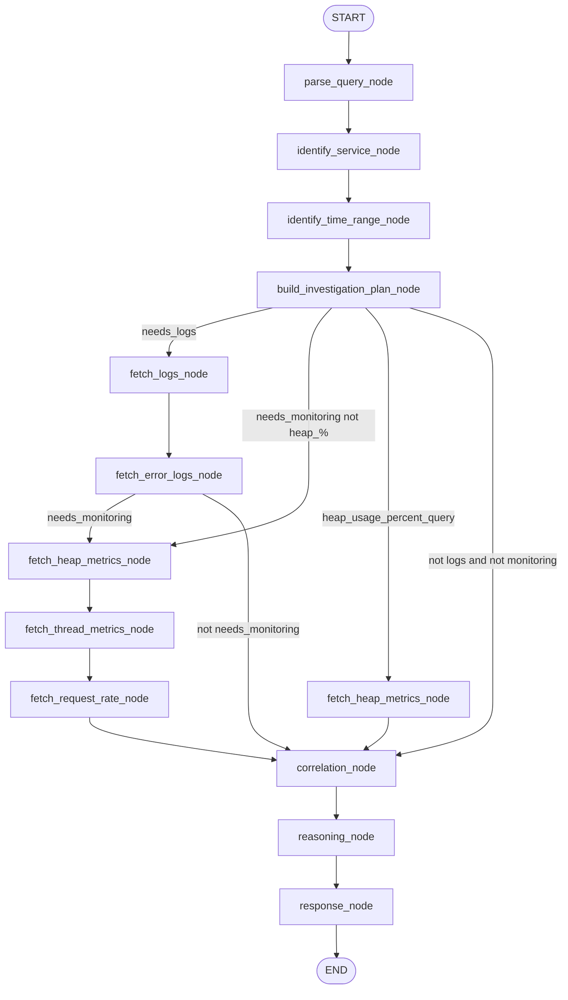

# Observability Debug Agent — LangGraph Workflow

Source: [`workflow.py`](workflow.py) — `InvestigationWorkflow._build_graph()`

The graph uses **conditional edges** after `build_investigation_plan_node`. Classification is keyword-based in [`classification.py`](classification.py); fetch nodes are skipped when flags are false (empty lists, no observability-server calls).

## Flow diagram

## Investigation modes (decision table)

| Query pattern | needs_logs | needs_monitoring | heap_usage_percent_query |
|---------------|------------|------------------|--------------------------|
| Slow / slowness / latency (traffic-spike) | Y | Y | N |
| Error / stack / coupon / details only | Y | N | N |
| Heap usage % (no slow, no error keywords) | N | Y | Y |
| Both slow + error keywords | Y | Y | N |
| Neither keyword set | Y | Y (default) | N |

### Examples

| Query | needs_logs | needs_monitoring | heap_% |
|-------|------------|------------------|--------|
| Why is ecommerce slow in the last 15 minutes? | Y | Y | N |
| Find reason for slowness for correlation id \<uuid\> | Y | Y | N |
| Give me details of error for request \<uuid\> | Y | N | N |
| What is the heap usage of ecommerce-service? | N | Y | Y |

## Fetch flags (`classify_investigation`)

| Mode | fetch_logs | fetch_error_logs | fetch_heap | fetch_heap_max | fetch_threads | fetch_request_rate |
|------|------------|------------------|------------|----------------|---------------|---------------------|
| Traffic-spike / slow | Y | Y | Y | N | Y | Y |
| Coupon / error only | Y | Y | N | N | N | N |
| Heap usage % | N | N | Y | Y | N | N |

`fetch_heap_metrics_node` loads **used** when `fetch_heap_metrics` is true and **max** when `fetch_heap_max_metrics` is true (same node).

## Nodes and edges

| Node | Routing |
|------|---------|
| `build_investigation_plan_node` | → `fetch_logs_node` if `needs_logs`; else → `fetch_heap_metrics_node` if `needs_monitoring`; else → `correlation_node` |
| `fetch_logs_node` | → `fetch_error_logs_node` if `fetch_error_logs`; else → `correlation_node` |
| `fetch_error_logs_node` | → `fetch_heap_metrics_node` if `fetch_heap_metrics`; else → `correlation_node` |
| `fetch_heap_metrics_node` | → `fetch_thread_metrics_node` if `fetch_thread_metrics`; else → `correlation_node` |
| `fetch_thread_metrics_node` | → `fetch_request_rate_node` (always) |
| `fetch_request_rate_node` | → `correlation_node` |

## Reasoning modes (`reasoning_node`)

| Mode | When | Prompt |
|------|------|--------|
| `default` | `needs_monitoring` and not logs-only and not heap-% | Slow / saturation (existing) |
| `error_logs` | `needs_logs` and not `needs_monitoring` | [`error_logs.py`](../prompts/error_logs.py) |
| `heap_percent` | `heap_usage_percent_query` | Percent-first; used/max from metrics |

## Response (`response_node`)

| Condition | Grafana |
|-----------|---------|
| `needs_logs` + `request_id` | Explore link |
| `needs_monitoring` | Metrics dashboard link |
| Logs-only (coupon) | Explore only |

## Shared state (`InvestigationState`)

Key fields: `needs_logs`, `needs_monitoring`, `heap_usage_percent_query`, `fetch_*`, `heap_max_metrics`, `correlation`, `summary`, `grafana_explore_url`, `grafana_dashboard_url`.
