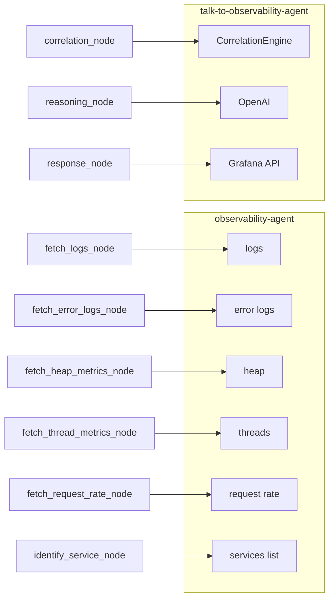

# Talk-to-Observability LangGraph Workflow

Source: [`workflow.py`](workflow.py) — `InvestigationWorkflow._build_graph()`

The graph is a **linear pipeline** (no conditional edges). Fetch nodes always run; each may skip observability-agent calls based on flags set in `build_investigation_plan_node`.

## Flow diagram

```mermaid
flowchart TD
    START([START]) --> parse_query_node

    parse_query_node["parse_query_node<br/><i>Extract correlation ID, issue type</i>"]
    identify_service_node["identify_service_node<br/><i>Resolve target service</i>"]
    identify_time_range_node["identify_time_range_node<br/><i>Parse time window</i>"]
    build_investigation_plan_node["build_investigation_plan_node<br/><i>Set fetch_* flags</i>"]
    fetch_logs_node["fetch_logs_node<br/><i>Logs by correlation or service</i>"]
    fetch_error_logs_node["fetch_error_logs_node<br/><i>Error logs</i>"]
    fetch_heap_metrics_node["fetch_heap_metrics_node<br/><i>Heap metrics</i>"]
    fetch_thread_metrics_node["fetch_thread_metrics_node<br/><i>Thread metrics</i>"]
    fetch_request_rate_node["fetch_request_rate_node<br/><i>Request rate</i>"]
    correlation_node["correlation_node<br/><i>Deterministic RCA</i>"]
    reasoning_node["reasoning_node<br/><i>OpenAI summary</i>"]
    response_node["response_node<br/><i>Grafana links + final summary</i>"]
    END_NODE([END])

    parse_query_node --> identify_service_node
    identify_service_node --> identify_time_range_node
    identify_time_range_node --> build_investigation_plan_node
    build_investigation_plan_node --> fetch_logs_node
    fetch_logs_node --> fetch_error_logs_node
    fetch_error_logs_node --> fetch_heap_metrics_node
    fetch_heap_metrics_node --> fetch_thread_metrics_node
    fetch_thread_metrics_node --> fetch_request_rate_node
    fetch_request_rate_node --> correlation_node
    correlation_node --> reasoning_node
    reasoning_node --> response_node
    response_node --> END_NODE

    classDef planning fill:#e8f4fc,stroke:#2563eb,color:#1e3a5f
    classDef fetch fill:#fef3c7,stroke:#d97706,color:#78350f
    classDef analyze fill:#dcfce7,stroke:#16a34a,color:#14532d
    classDef output fill:#f3e8ff,stroke:#9333ea,color:#581c87

    class parse_query_node,identify_service_node,identify_time_range_node,build_investigation_plan_node planning
    class fetch_logs_node,fetch_error_logs_node,fetch_heap_metrics_node,fetch_thread_metrics_node,fetch_request_rate_node fetch
    class correlation_node,reasoning_node analyze
    class response_node output
```



## ASCII overview

```
START
  │
  ▼
┌─────────────────────┐
│  parse_query_node   │
└──────────┬──────────┘
           ▼
┌─────────────────────┐
│ identify_service_   │
│       node          │
└──────────┬──────────┘
           ▼
┌─────────────────────┐
│ identify_time_range │
│       _node         │
└──────────┬──────────┘
           ▼
┌─────────────────────┐
│ build_investigation │
│     _plan_node      │
└──────────┬──────────┘
           ▼
┌─────────────────────┐     observability-agent
│  fetch_logs_node    │ ──► logs (by correlation ID or service)
└──────────┬──────────┘
           ▼
┌─────────────────────┐
│ fetch_error_logs_   │ ──► error logs (if fetch_error_logs)
│       node          │
└──────────┬──────────┘
           ▼
┌─────────────────────┐
│ fetch_heap_metrics_ │ ──► heap (if fetch_heap_metrics)
│       node          │
└──────────┬──────────┘
           ▼
┌─────────────────────┐
│ fetch_thread_       │ ──► threads (if fetch_thread_metrics)
│   metrics_node      │
└──────────┬──────────┘
           ▼
┌─────────────────────┐
│ fetch_request_rate_ │ ──► request rate (if fetch_request_rate)
│       node          │
└──────────┬──────────┘
           ▼
┌─────────────────────┐
│  correlation_node   │ ──► CorrelationEngine (deterministic)
└──────────┬──────────┘
           ▼
┌─────────────────────┐
│  reasoning_node     │ ──► OpenAI chat completion
└──────────┬──────────┘
           ▼
┌─────────────────────┐
│  response_node      │ ──► Grafana Explore + dashboard URLs
└──────────┬──────────┘
           ▼
         END
```

## Nodes and edges (from code)

| # | Node | Next | Role |
|---|------|------|------|
| — | **START** | `parse_query_node` | Entry (`set_entry_point`) |
| 1 | `parse_query_node` | `identify_service_node` | Parse query; extract correlation/request ID; classify `issue_type` |
| 2 | `identify_service_node` | `identify_time_range_node` | List services; match alias or default `ecommerce-service` |
| 3 | `identify_time_range_node` | `build_investigation_plan_node` | Default last 15 min; or `last N minutes` / `between HH:MM` |
| 4 | `build_investigation_plan_node` | `fetch_logs_node` | Set `fetch_logs`, `fetch_error_logs`, `fetch_heap_metrics`, etc. from `issue_type` |
| 5 | `fetch_logs_node` | `fetch_error_logs_node` | Correlation logs or service logs via observability-agent |
| 6 | `fetch_error_logs_node` | `fetch_heap_metrics_node` | Error logs (when flag true) |
| 7 | `fetch_heap_metrics_node` | `fetch_thread_metrics_node` | Heap metrics (when flag true) |
| 8 | `fetch_thread_metrics_node` | `fetch_request_rate_node` | Thread metrics (when flag true) |
| 9 | `fetch_request_rate_node` | `correlation_node` | Request-rate metrics (when flag true) |
| 10 | `correlation_node` | `reasoning_node` | Build `InvestigationContext`; run `CorrelationEngine` |
| 11 | `reasoning_node` | `response_node` | OpenAI summary from correlation evidence |
| 12 | `response_node` | **END** | Append Grafana links; set `grafana_*_url` on state |
| — | **END** | — | `graph.compile()` returns `InvestigationResponse` in `run()` |

## Investigation plan flags (`build_investigation_plan_node`)

`fetch_logs` is always `true`. Other flags depend on `issue_type` and whether a correlation ID is present:

| Flag | Enabled when |
|------|----------------|
| `fetch_error_logs` | `issue_type` ∈ timeout, latency, errors, general **or** `request_id` set |
| `fetch_heap_metrics` | `issue_type` ∈ timeout, latency, heap, general |
| `fetch_thread_metrics` | `issue_type` ∈ timeout, latency, threads, general |
| `fetch_request_rate` | `issue_type` ∈ timeout, latency, request-rate, errors, general |

## Shared state (`InvestigationState`)

Key fields written across the pipeline:

| Phase | Fields |
|-------|--------|
| Input | `request`, `investigation_id`, `query` |
| Parse / plan | `request_id`, `issue_type`, `service_name`, `start_time`, `end_time`, `fetch_*` |
| Fetch | `logs`, `error_logs`, `heap_metrics`, `thread_metrics`, `request_rate_metrics` |
| Analyze | `correlation`, `summary`, `probable_root_cause`, `evidence` |
| Output | `grafana_explore_url`, `grafana_dashboard_url` |

## External dependencies per phase


